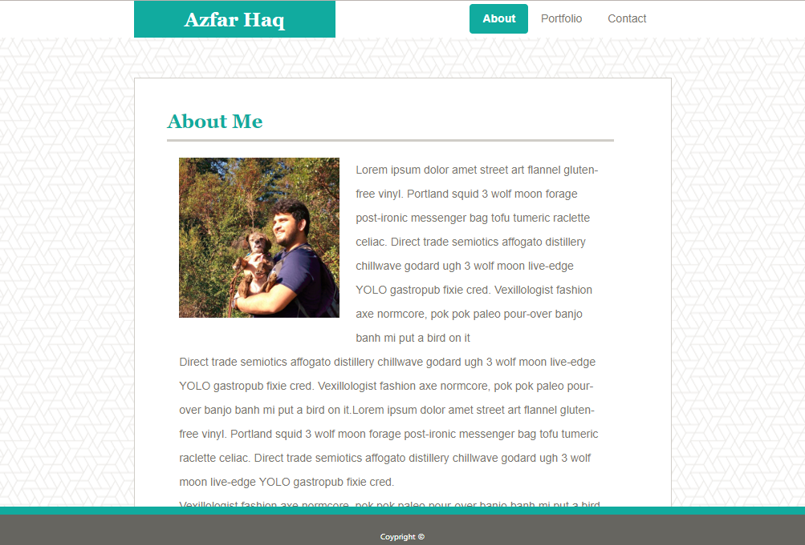
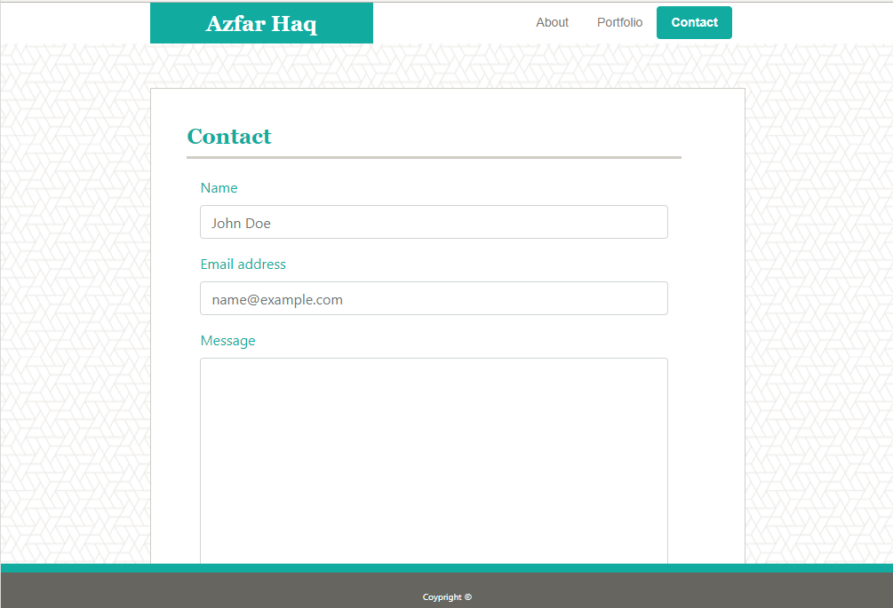

# Boostrap-Portfolio
Recreating the mobile website primarily using BootStrap.

# Link to Deployed Site
[Basic-Portfolio](https://aehaq.github.io/Bootstrap-Portfolio)

# Images




# Technology Used
- html
- CSS
- CSS (Bootstrap)

# Code Snippets
```
<div class="container-fluid">
        
        <div class="row">
            <div class="col-md-2 col-sm-1 col-1"></div>

            <div class="col-md-8 col-sm-10 col-10 content-container">
                <div class="row">

                    <div class="col"></div>

                    <div class="col-md-10 col-sm-10 col-10 content-body">
                        
                        <!-- Unique Page Content in Here -->

                    </div>

                    <div class="col"></div>

                </div>
                <div class="row"></div>
            </div>
            
            <div class="col-md-2 col-sm-1 col-1"></div>

        </div>

    </div>
```
- Above is an example of a bootstrap grid nested within another bootstrap grid. This served as the main box within which every pages unique content was stored. These grids also adjust based on the size of the browser or device used to view the website. 

# Learning Points
- Creating a Navbar in BootStrap, using classes to denote "Active" links.
- Using the bootstrap grid system.
- Creating varying column organizations for different media sizes.
- Nesting grids within grids.
- Creating a secondary stylesheet to further customize existing bootstrap classes.

# Author 
Azfar Haq - [GitHub](https://github.com/aehaq)

# License
Standard MIT License